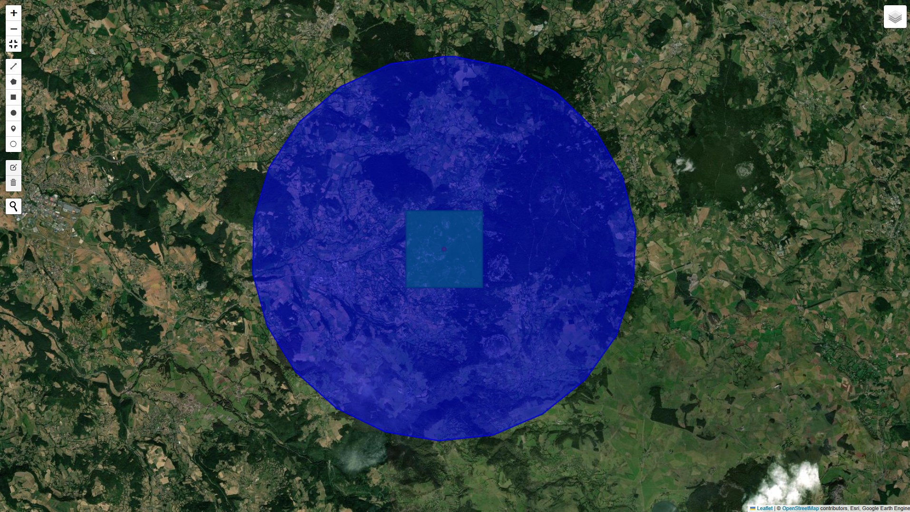

# Lyra_Sentinel_MODIS_Site_HauteLoire

**A reproducible remote sensing pipeline combining Sentinel-2 NDVI and MODIS LST for a selected ecological site in Haute-Loire, France.**

## Project Overview

This repository demonstrates a compact, transparent workflow to extract and monitor two key biophysical variables:
- **Normalized Difference Vegetation Index (NDVI)** — Sentinel-2 Harmonized, clipped to a 1 km ROI.
- **Land Surface Temperature (LST)** — MODIS MOD11A1, averaged over a 5 km buffer.

Both metrics are computed for a precise point located in Haute-Loire, representing a semi-natural meadow-bocage ecosystem, and intended to feed into Lyra's open ecological models.

## Site Information

| Parameter | Value |
|-----------|-------|
| **Longitude** | 4.0966666 E |
| **Latitude**  | 45.0430555 N |
| **NDVI ROI (visualized)** | Square buffer ~1 km |
| **LST ROI (visualized)**  | Disk buffer ~5 km |
| **Time period** | May 15 — June 15, 2025 |

## Results

| Variable | Value |
|----------|-------|
| **Mean NDVI** | ~0.85 (2 decimal places) |
| **Mean LST (°C)** | ~18.8 °C (1 decimal place) |

These values reflect the site’s healthy vegetative activity and typical late spring surface temperatures in a mid-altitude French upland context.
The NDVI (~0.85) corresponds to the first clear-sky day within the 15 May – 15 June period, ensuring high atmospheric transparency and optimal leaf reflectance, representative of maximum photosynthetic activity for this bocage site.

## 📁 Repository Structure

```plaintext
Lyra_Sentinel_MODIS_Site_HauteLoire/
│
├── README.md                  # Project overview and instructions
├── data_and_results/          # All scripts, outputs and visual aids
│   ├── NDVI_LST_HauteLoire.ipynb   # Jupyter Notebook (full pipeline)
│   ├── NDVI_LST_HauteLoire.md      # Markdown version (easy reading)
│   ├── NDVI_LST_map.jpg            # Result map: NDVI square & LST disk
│   └── NDVI_LST_HauteLoire.csv     # (Optional) CSV export with computed values


   
## Dependencies

This pipeline relies on:
- `earthengine-api`
- `geemap` (Folium mode for robust interactive map display)

Install via:
```bash
pip install earthengine-api geemap
```

## How to Use

1. Clone this repo and open the notebook:
   ```bash
   git clone https://github.com/yourusername/Lyra_Sentinel_MODIS_Site_HauteLoire.git
   cd Lyra_Sentinel_MODIS_Site_HauteLoire
   ```

2. Authenticate your Google Earth Engine account inside the notebook:
   ```python
   import ee
   ee.Authenticate()
   ee.Initialize()
   ```

3. Run all cells to reproduce:
   - NDVI & LST computation
   - ROI clipping & visualization
   - CSV export to Google Drive
   - Interactive map with clear buffer overlays.

## Key Concepts

- **ROI Clipping:** NDVI visualization is clipped to a 1 km square to avoid displaying the full Sentinel-2 tile (~100 km²).
- **Buffering:** LST is computed using a larger disk to smooth out thermal heterogeneity.
- **Low Precision:** Outputs are rounded to 2 decimals (NDVI) and 1 decimal (LST) for ecological realism.

## Map Preview



🔗 Related project:

🔗 Part of the Lyra Ecosystem
- [Lyra_Leaf_SPAD_Calibration](https://github.com/Jerome-openclassroom/Lyra_Leaf_SPAD_Calibration) – SPAD sensor calibration for estimating chlorophyll density in leaves.
- [Lyra_LowCost_Soil_Leaf](https://github.com/Jerome-openclassroom/Lyra_LowCost_Soil_Leaf) – Integrated low-cost soil and leaf model for terrestrial primary productivity.
- [Leaf_Chlorose_CNN_Training](https://github.com/Jerome-openclassroom/Leaf_Chlorose_CNN_Training) – CNN-based classification of chlorotic vs. healthy leaves from scanned images.
- [TurbiditySensor_OpenScience](https://github.com/Jerome-openclassroom/TurbiditySensor_OpenScience) - A low-cost optical turbidity sensor calibrated in JTU, illustrating an open science approach for accessible, field-based water quality monitoring.
- [AI_Assisted_Lake_Ecology](https://github.com/Jerome-openclassroom/AI_Assisted_Lake_Ecology) – A full-scale NPP model combining field measurements, physical modeling, and GPT-4o-assisted ecological interpretation. Includes empirical correction for realistic annual productivity in clear lakes.
- [LimonTree_NPP_Model](https://github.com/Jerome-openclassroom/LimonTree_NPP_Model) — Low-cost water and NPP model for a potted lemon tree.
- [Lyra_DO_Green_Mesurim](https://github.com/Jerome-openclassroom/Lyra_DO_Green_Mesurim) - A low-tech protocol combining MesurimPro and ImageJ to estimate chlorophyll levels from scanned leaves, with validation against SPAD readings and AI-assisted correlation analysis.
- [Mountain_Bocage_Soil_Analysis](https://github.com/Jerome-openclassroom/Mountain_Bocage_Soil_Analysis) — Complete soil dataset for a mid-mountain bocage site (Haute-Loire, France): texture, CEC, pH, nitrates, structural stability, and Berlèse funnel microfauna extraction. Ready for AI-assisted ecological modeling.
- [Eco_Profile_Saint_Julien_1060](https://github.com/Jerome-openclassroom/eco-profile-saint-julien-1060) — 1-ha eco-climatological site (1060 m, Massif Central) with 2017–2018 records and multi-disciplinary field data.
- For field-based plant identification and LLM-assisted inference of ecological co-occurrence:  
[**Lyra_Botanical_Protocol**](https://github.com/Jerome-openclassroom/lyra-botanical-protocol) —  
*Protocol for probabilistic GPT-based species identification from photos and context (southern France, spring flora).*

  
## 🔖 License
MIT License – open science, open ecology.
